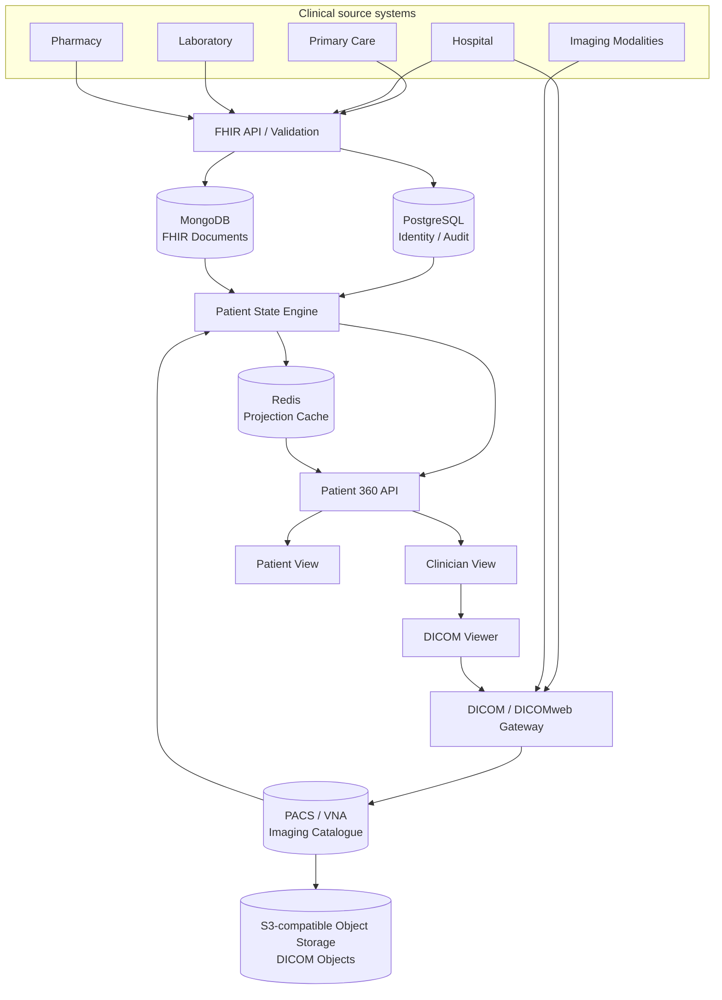

# SNS Patient 360

Patient-centred longitudinal health record reference platform for the Portuguese SNS, using HL7 FHIR, DICOM/DICOMweb, synthetic clinical systems, provenance, consent and auditable Patient 360 views.

> This is an independent reference implementation and is not an official SNS or SPMS product. The project uses synthetic data only.

## Goal

The platform explores how fragmented clinical information can be reconstructed into one longitudinal patient view without replacing the systems that generated it.

The core product question is:

> Can a clinician understand the patient's current state, recent history, diagnostic imaging and pending care from one auditable view?

## Architecture



FHIR remains the clinical interoperability contract. DICOM/DICOMweb is the imaging interoperability contract. Patient 360 is a derived application read model: it stores imaging relationships and metadata, not diagnostic pixel payloads.

Persistence is deliberately polyglot:

- PostgreSQL holds relational identity, alias, consent/audit and ingestion metadata;
- MongoDB preserves complete versioned FHIR documents and diagnostic reports;
- PACS/VNA owns DICOM studies, series, instances and imaging lifecycle;
- S3-compatible object storage holds large DICOM binary objects behind the PACS/VNA boundary;
- Redis holds disposable, rebuildable Patient 360 projections and is never authoritative clinical storage.

All versioned architecture and process diagrams use Mermaid. See [`docs/architecture/system-architecture.md`](docs/architecture/system-architecture.md), [`docs/architecture/imaging.md`](docs/architecture/imaging.md), [`docs/architecture/ingestion-persistence.md`](docs/architecture/ingestion-persistence.md) and [`docs/architecture/requirements.md`](docs/architecture/requirements.md).

## Initial clinical scope

The first release covers patient identity, encounters, active and historical conditions, medication, allergies, laboratory observations and diagnostic reports, procedures, immunisations, appointments/referrals, documents, diagnostic imaging references, consent, provenance and audit events.

## Engineering principles

- Python 3.11+
- FastAPI and Pydantic
- HL7 FHIR for clinical exchange
- DICOM/DICOMweb for diagnostic imaging
- PostgreSQL for relational identity and audit metadata
- MongoDB for complete versioned FHIR documents
- PACS/VNA for imaging lifecycle
- S3-compatible object storage for DICOM bulk objects
- Redis for non-authoritative Patient 360 caching
- Docker Compose for local orchestration
- typed Python with strict `mypy`
- `ruff` for linting
- `pytest` for behavioural and contract tests
- Mermaid for versioned architecture and process diagrams
- synthetic data only
- no Kubernetes until there is a concrete operational requirement
- no AI diagnosis or autonomous treatment recommendation

## Repository direction

```text
apps/
  clinician-web/
  patient-web/
services/
  api/
  ingestion/
  patient-state/
  imaging/
  audit/
packages/
  fhir/
  dicom/
  clinical-model/
synthetic/
  primary-care/
  hospital/
  laboratory/
  pharmacy/
  imaging/
docs/
  architecture/
  data-model/
  security/
  adr/
tests/
```

See [`ROADMAP.md`](ROADMAP.md) for the implementation sequence.
