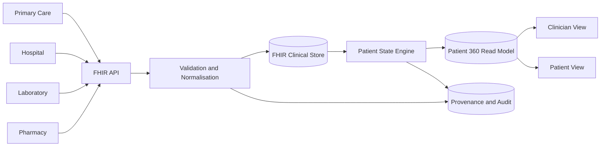

# SNS Patient 360

Patient-centred longitudinal health record reference platform for the Portuguese SNS, using HL7 FHIR, synthetic clinical systems, provenance, consent and auditable Patient 360 views.

> This is an independent reference implementation and is not an official SNS or SPMS product. The project uses synthetic data only.

## Goal

The platform explores how fragmented clinical information can be reconstructed into one longitudinal patient view without replacing the systems that generated it.

The core product question is:

> Can a clinician understand the patient's current state, recent history and pending care from one auditable view?

## Architecture



FHIR is the interoperability contract. Patient 360 is a derived application read model. Every derived clinical item must remain traceable to the FHIR resources that support it.

All versioned architecture and process diagrams use Mermaid. See [`docs/architecture/system-architecture.md`](docs/architecture/system-architecture.md) for the full architecture and [`docs/architecture/requirements.md`](docs/architecture/requirements.md) for the functional and non-functional requirements.

## Initial clinical scope

The first release covers:

- patient identity;
- encounters;
- active and historical conditions;
- medication;
- allergies;
- laboratory observations and diagnostic reports;
- procedures;
- immunisations;
- appointments, referrals and service requests;
- documents;
- consent;
- provenance and audit events.

## v0.1.0 target

The first demonstrable milestone will reconstruct one synthetic patient journey from at least four simulated source systems:

1. primary care;
2. hospital;
3. laboratory;
4. pharmacy.

The resulting API must expose a Patient 360 summary and unified timeline with source provenance.

## Engineering principles

- Python 3.11+
- FastAPI and Pydantic
- PostgreSQL for persistent clinical data
- Docker Compose for local orchestration
- typed Python with strict `mypy`
- `ruff` for linting
- `pytest` for behavioural and contract tests
- Mermaid for versioned architecture and process diagrams
- synthetic data only
- no Kubernetes until there is a concrete operational requirement
- no AI diagnosis or autonomous treatment recommendation

## Repository direction

```text
apps/
  clinician-web/
  patient-web/
services/
  api/
  ingestion/
  patient-state/
  audit/
packages/
  fhir/
  clinical-model/
synthetic/
  primary-care/
  hospital/
  laboratory/
  pharmacy/
docs/
  architecture/
  data-model/
  security/
  adr/
tests/
```

The directories will be introduced as their corresponding milestones become executable rather than populated with empty placeholders.

See [`ROADMAP.md`](ROADMAP.md) for the implementation sequence.