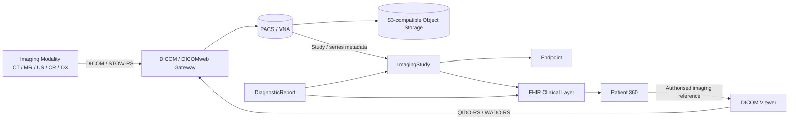
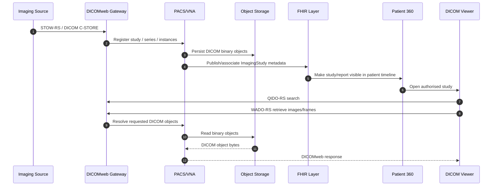
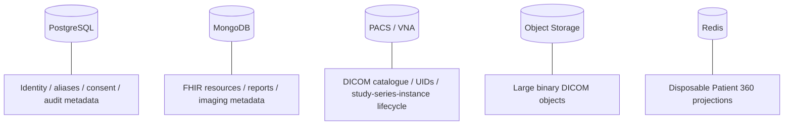
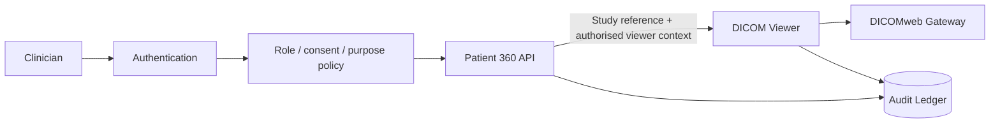

# Diagnostic imaging architecture

## Purpose

Diagnostic images are not ordinary clinical documents. SNS Patient 360 therefore separates the **clinical relationship to imaging** from the **DICOM objects that contain the diagnostic image data**.

FHIR resources describe why an imaging study exists, how it relates to the patient and report, and where it can be retrieved. DICOM/DICOMweb owns the imaging study, series, instances, frames and pixel data.

## Imaging boundary

The Patient 360 application never writes arbitrary DICOM files directly to object storage. The PACS/VNA is responsible for imaging lifecycle and storage semantics.

## DICOMweb operations

The imaging service boundary uses DICOMweb operations:

- **QIDO-RS** for study, series and instance search;
- **WADO-RS** for retrieval of studies, series, instances, frames, metadata and rendered representations;
- **STOW-RS** for storage of DICOM studies/instances into the imaging system.

## FHIR relationship

`ImagingStudy` is the FHIR representation of the study relationship and DICOM identifiers. `DiagnosticReport` carries the clinical interpretation/report and may reference the study. `Endpoint` provides retrieval connection information where appropriate.

Patient 360 may expose:

- study date;
- modality;
- description / body site when available;
- Study Instance UID;
- series metadata;
- study status;
- linked diagnostic report;
- authorised viewer/retrieval endpoint;
- provenance.

Patient 360 MUST NOT treat the DICOM pixel payload as a MongoDB/FHIR document field.

## Storage responsibilities

Object storage is an implementation detail behind the PACS/VNA boundary. The reference local stack uses an S3-compatible service to model that bulk-storage role.

## Imaging provenance

Imaging references must preserve enough information to answer:

1. Which patient/canonical identity is this study associated with?
2. Which source organisation/system supplied it?
3. What are the DICOM Study/Series/SOP Instance UIDs?
4. Which FHIR `ImagingStudy` and `DiagnosticReport` describe it?
5. Which endpoint/PACS is authoritative for retrieval?
6. Who accessed the imaging study and for what purpose?

## Security boundary

The viewer and DICOMweb gateway must not be reachable through an unauthorised Patient 360 link. Production architecture must authenticate/authorise image retrieval and audit access to studies.

## Local reference implementation

The planned local imaging stack is:

- **Orthanc** as the reference PACS/DICOMweb service;
- **MinIO** as S3-compatible bulk object storage;
- DICOMweb enabled on Orthanc;
- optional web viewer support later.

The architecture deliberately keeps PACS/VNA and object storage as separate concepts even when they run in the same local Docker Compose environment.

## Out of scope for this architecture milestone

- production SNS imaging integration;
- real DICOM patient data;
- diagnostic AI over image pixels;
- automated radiology interpretation;
- full modality worklist implementation;
- pathology/whole-slide imaging semantics beyond noting that they may require additional specialised profiles.
