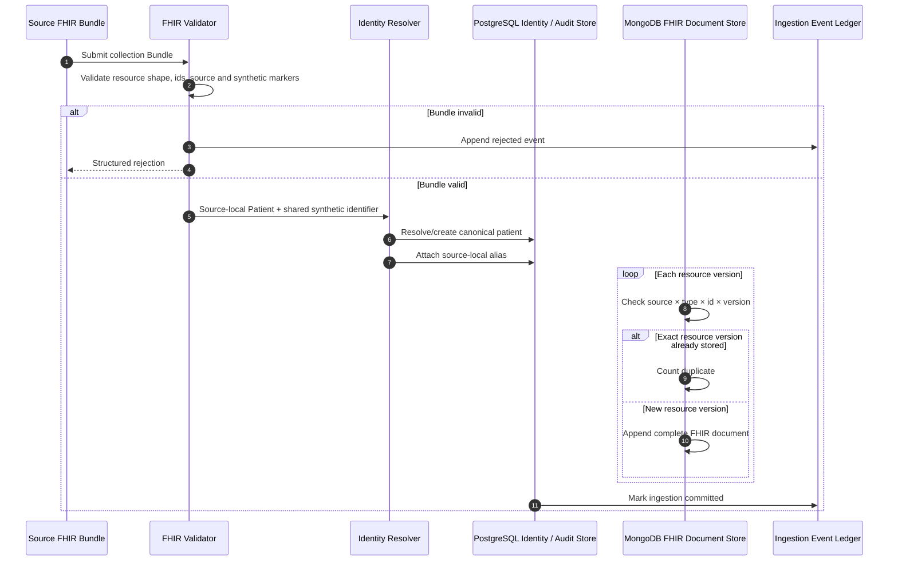
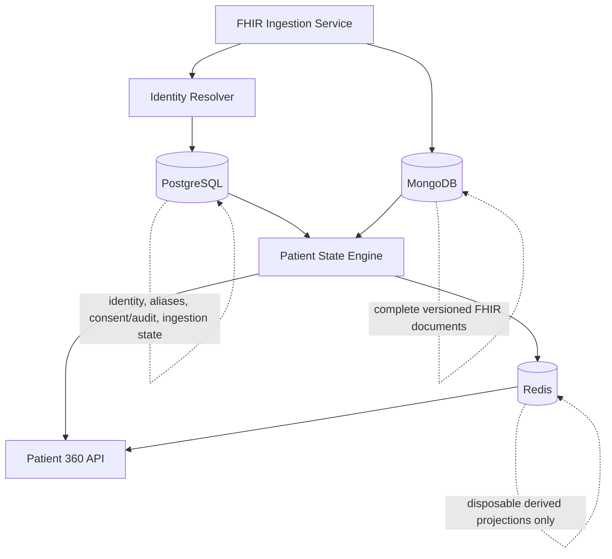
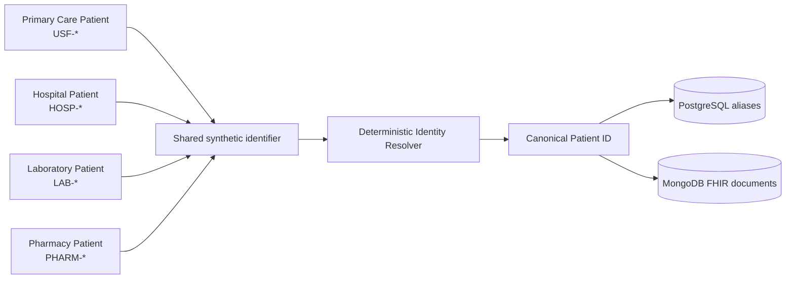
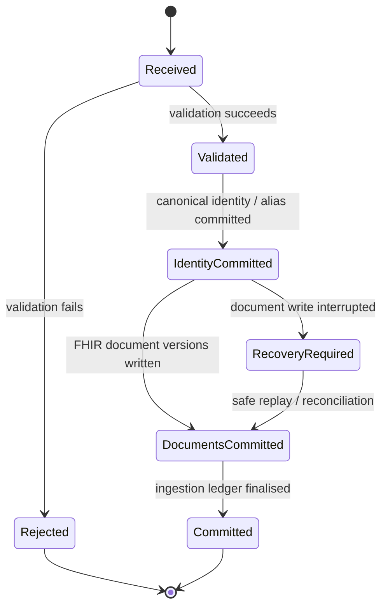

# FHIR ingestion and canonical longitudinal persistence

## Scope

This milestone implements the boundary between independent source bundles and the canonical clinical store. It does not yet derive the Patient 360 read model.

Implements: `FR-001`, `FR-010`, `FR-011`, `FR-012`, `FR-013`, `FR-014`, `FR-020`, `NFR-020`, `NFR-021`, `NFR-022`, `NFR-023`, `NFR-042`.

## Ingestion flow

## Polyglot persistence architecture

### PostgreSQL responsibility

PostgreSQL owns data with strong relational constraints:

- canonical patient identity;
- source-local patient aliases;
- consent and access-control metadata as introduced;
- ingestion coordination state;
- audit/ingestion ledger metadata.

### MongoDB responsibility

MongoDB owns complete clinical source documents:

- FHIR payloads are stored without flattening their nested structure;
- source-version identity is `(source, resourceType, id, versionId)`;
- exact replay is idempotent;
- a different payload under the same source-version key is rejected;
- new source versions are appended rather than overwriting history;
- documents remain queryable by canonical patient id and resource type.

### Redis responsibility

Redis is reserved for rebuildable Patient 360 projections and cache entries. It is explicitly non-authoritative: deletion or total Redis loss must not destroy clinical truth, because projections can be reconstructed from PostgreSQL plus MongoDB.

## Identity-resolution boundary

The current resolver intentionally uses the explicit shared synthetic identifier. Probabilistic or demographic record linkage is out of scope and must not be introduced silently.

## Cross-database consistency

PostgreSQL and MongoDB do not share one implicit ACID transaction boundary. The architecture therefore uses a recoverable idempotent protocol rather than pretending distributed atomicity exists.

Deterministic source-version keys and idempotent replay make partial operations recoverable. The application must not expose an ingestion operation as fully committed until both the relational metadata and required MongoDB document writes have succeeded.

## Local development

`docker-compose.yml` provides:

- PostgreSQL for relational state;
- MongoDB for FHIR documents;
- Redis for disposable projection caching.

Unit tests may use isolated in-memory/test doubles so the default CI suite remains independent of external healthcare systems. Database integration tests should use the real services in dedicated integration workflows.

## Next boundary

The Patient State Engine will consume PostgreSQL identity metadata plus MongoDB FHIR documents and produce rebuildable Patient 360 projections. Redis may accelerate those reads but must never become the only copy of clinically significant state.
