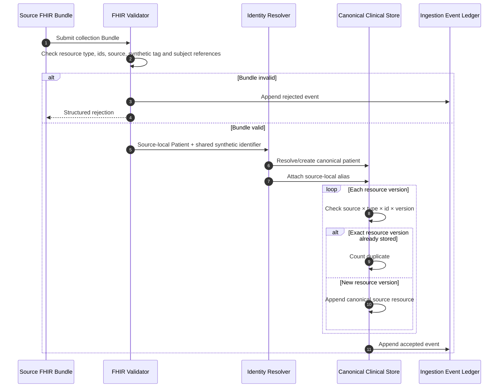
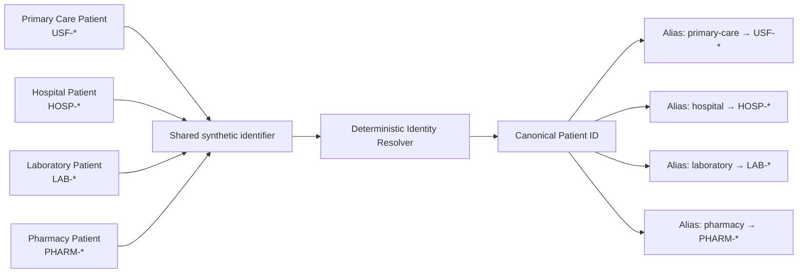
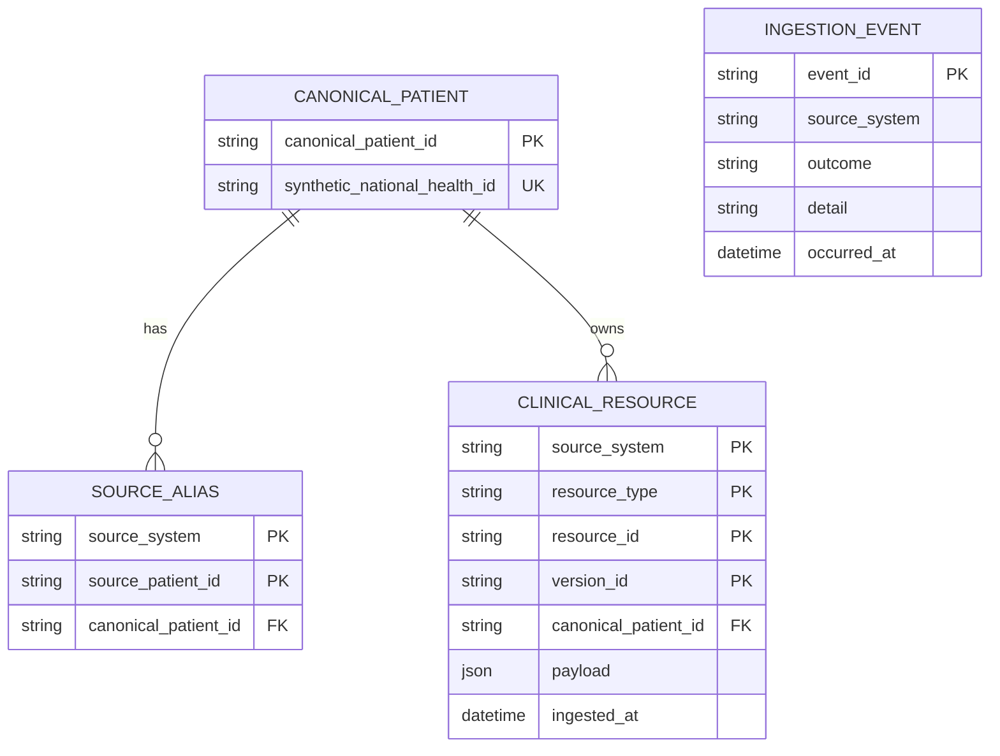
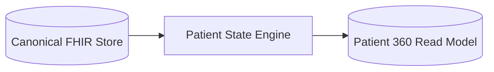

# FHIR ingestion and canonical longitudinal persistence

## Scope

This milestone implements the boundary between independent source bundles and the canonical clinical store. It does not yet derive the Patient 360 read model.

Implements: `FR-001`, `FR-010`, `FR-011`, `FR-012`, `FR-013`, `FR-014`, `FR-020`, `NFR-020`, `NFR-021`, `NFR-022`, `NFR-023`, `NFR-042`.

## Ingestion flow

## Identity-resolution boundary

The current resolver intentionally uses the explicit shared synthetic identifier. Probabilistic or demographic record linkage is out of scope for this milestone and must not be introduced silently.

## Persistence model

The source-version key is:

\[
(\text{source},\ \text{resourceType},\ \text{id},\ \text{versionId})
\]

An exact replay is idempotent. A new version is appended. A different payload presented under an already stored source-version key is rejected rather than silently overwriting the canonical record.

## Database portability

The persistence layer is implemented with SQLAlchemy. Automated tests use SQLite so CI has no external clinical or database dependency. The schema and transaction boundary are intentionally database-portable; PostgreSQL remains the target persistent database for the reference deployment architecture.

## Next boundary

The next milestone consumes the canonical clinical store and derives the Patient 360 read model:

