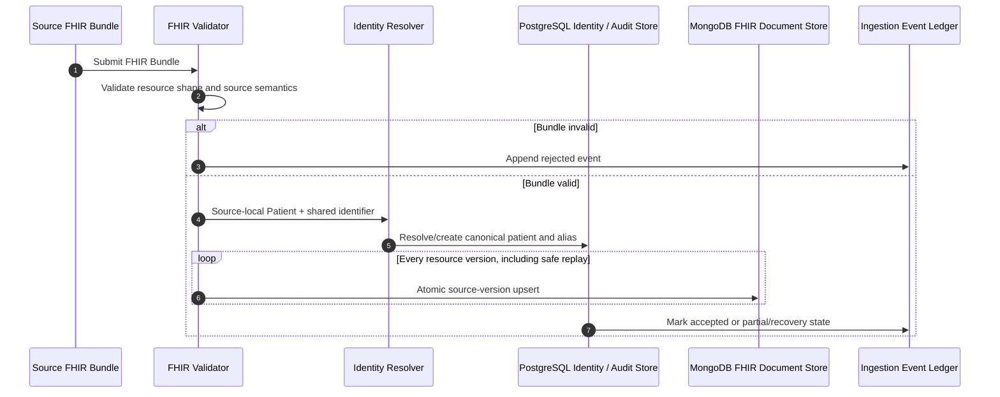
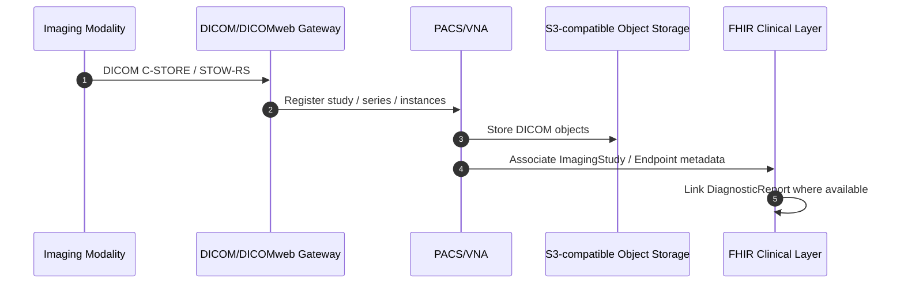
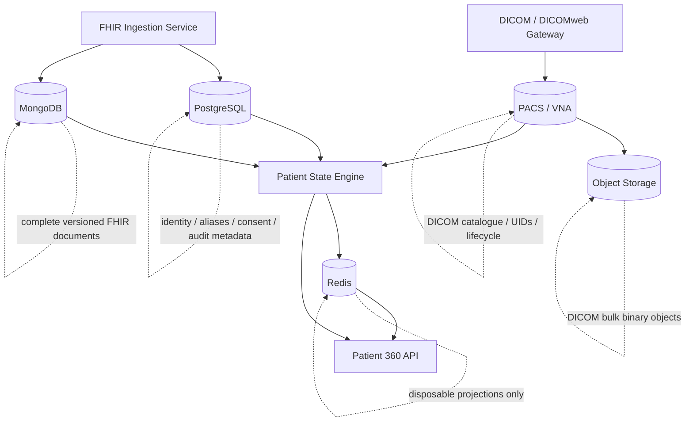
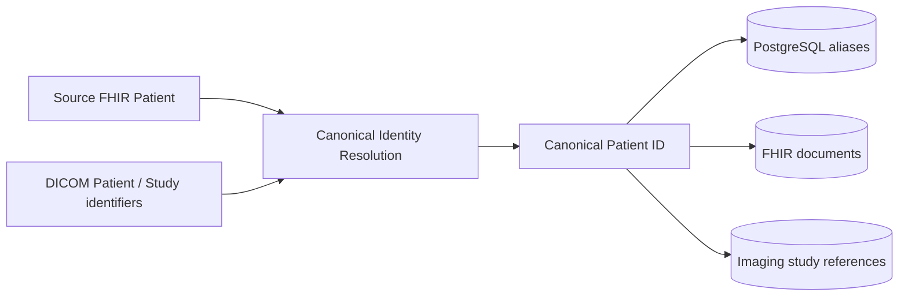
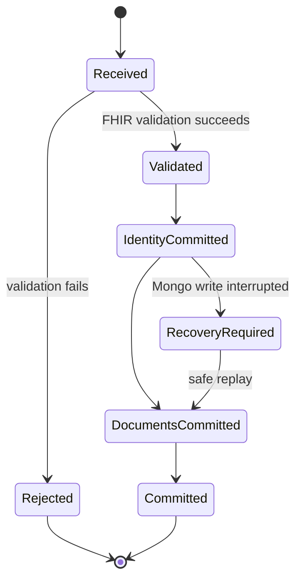
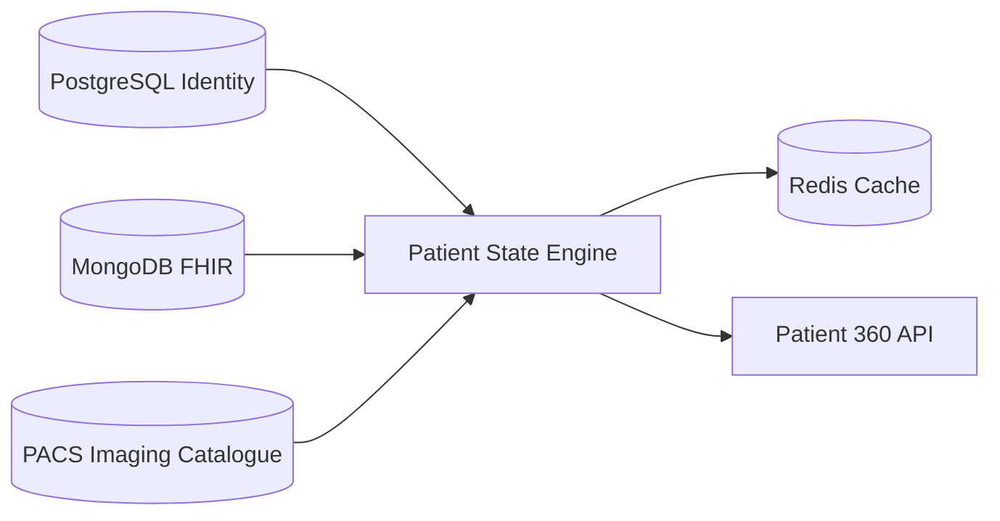

# Clinical ingestion, imaging and persistence

## Scope

SNS Patient 360 has multiple authoritative data planes because clinical documents and diagnostic imaging have different storage and protocol semantics.

- FHIR clinical documents use PostgreSQL + MongoDB.
- Diagnostic images use DICOM/DICOMweb + PACS/VNA + object storage.
- Redis stores only rebuildable Patient 360 projections.

## Clinical FHIR ingestion

## Imaging ingestion

The Patient 360 service does not write DICOM files directly to object storage. The PACS/VNA owns DICOM lifecycle and object-storage interaction.

## Authoritative data-plane architecture

### PostgreSQL responsibility

PostgreSQL owns data with strong relational constraints: canonical patient identity, source aliases, consent/access metadata, ingestion coordination and audit metadata.

### MongoDB responsibility

MongoDB owns complete FHIR clinical source documents and reports, preserving nested FHIR structure and source versions. It may contain `ImagingStudy`, `Endpoint` and `DiagnosticReport` resources, but not authoritative diagnostic image pixels.

### PACS/VNA responsibility

The PACS/VNA owns DICOM study, series and instance cataloguing, DICOM UIDs, image lifecycle, DICOM/DICOMweb operations and retrieval semantics.

### Object-storage responsibility

S3-compatible object storage owns large DICOM binary objects behind the PACS/VNA. Patient 360 application services must not make clinical decisions or viewer links from raw bucket/object keys.

### Redis responsibility

Redis contains only rebuildable Patient 360 projections and cache entries. Redis loss must not cause loss of clinical documents or DICOM studies.

## Patient identity across clinical and imaging planes

The synthetic reference implementation starts from deterministic identifiers. More complex patient matching must be introduced explicitly and must not silently merge uncertain identities.

## Cross-database recovery

PostgreSQL and MongoDB do not share a single ACID transaction. Clinical ingestion therefore uses deterministic source-version keys, partial-ingestion state, idempotent replay and reconciliation.

The DICOM/PACS/object-storage plane has its own storage lifecycle. A bulk-storage outage may temporarily prevent image retrieval, but it must not corrupt PostgreSQL identity data or MongoDB clinical documents.

## Local development

`docker-compose.yml` provides:

- PostgreSQL for relational identity/governance state;
- MongoDB for FHIR documents;
- Redis for disposable projection caching;
- Orthanc as the reference PACS/DICOMweb gateway;
- MinIO as S3-compatible DICOM bulk storage behind Orthanc.

Published development ports bind to loopback. Default CI remains independent of external clinical services; dedicated integration tests can exercise the real Docker services.

## Patient State Engine boundary

The Patient State Engine consumes metadata and references from the imaging plane. It must not download DICOM pixel payloads merely to construct the Patient 360 summary or timeline.
