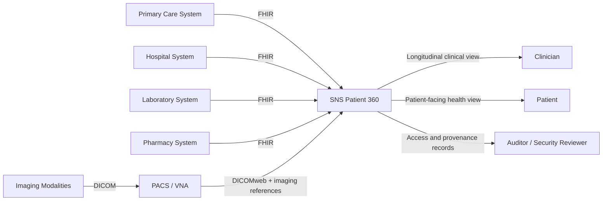
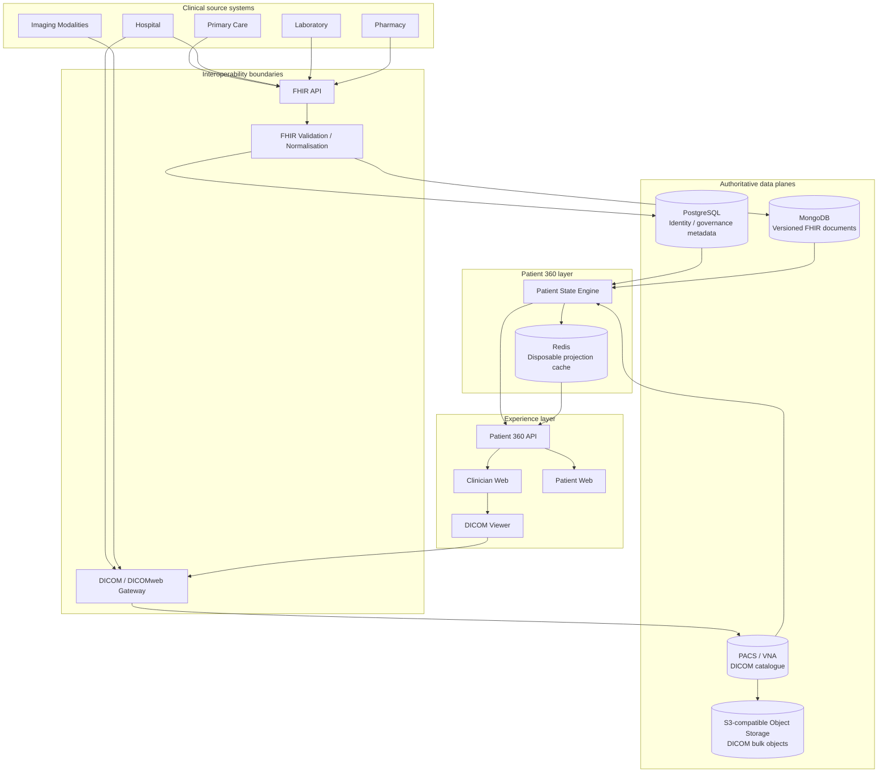
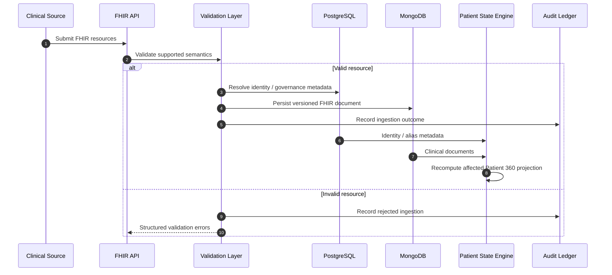
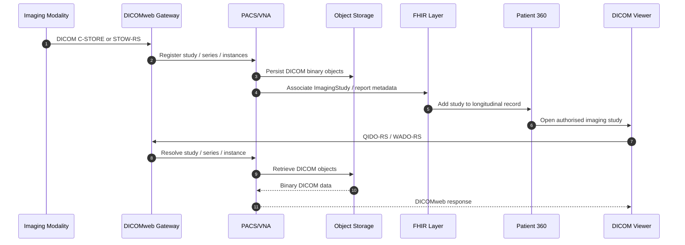
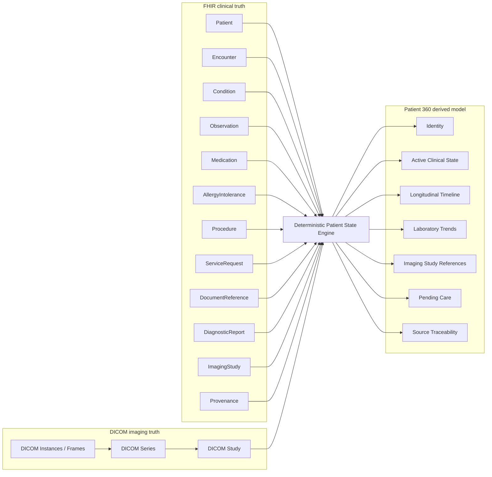
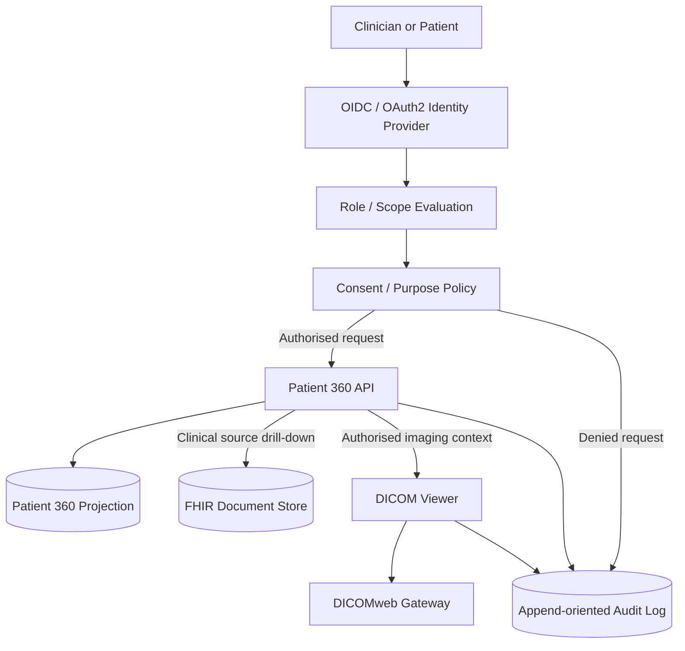
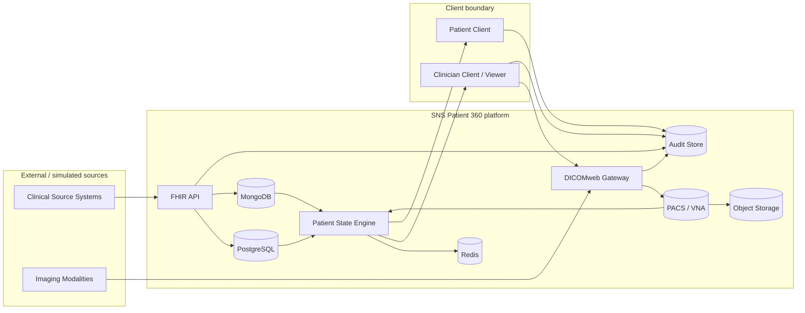

# System architecture

## Purpose

SNS Patient 360 reconstructs a unified longitudinal patient view from fragmented clinical source systems while preserving clinical meaning, provenance, consent context and auditability.

The platform does not replace source clinical systems. HL7 FHIR is the clinical interoperability boundary. DICOM/DICOMweb is the diagnostic-imaging interoperability boundary. Patient 360 is a derived read model optimised for clinician and patient-facing queries.

All architecture diagrams in this repository are expressed as Mermaid inside versioned Markdown documents.

## Architectural principles

1. **FHIR remains the clinical source/interchange truth.** Patient 360 does not redefine source clinical semantics.
2. **DICOM remains the diagnostic-imaging truth.** Image pixels and DICOM lifecycle do not belong in MongoDB or the Patient 360 read model.
3. **Derived state is traceable.** Every derived Patient 360 item must link to its supporting FHIR and/or imaging source.
4. **Conflicts are preserved.** Conflicting or superseded clinical facts must not be silently overwritten.
5. **Clinical state is temporal.** Current state and historical facts are distinct concepts.
6. **Access is auditable.** Reads, transformations and imaging retrieval must be attributable.
7. **Synthetic data only.** The reference implementation must not contain real patient data.
8. **AI is not part of the clinical truth layer.** Diagnosis and autonomous treatment recommendations are out of scope.

## System context

## Logical architecture

## Clinical ingestion and derivation

## Imaging ingestion and retrieval

## Patient 360 derivation boundary

Patient 360 derives imaging references and summary metadata; the DICOM study/series/instance hierarchy remains authoritative in the PACS/VNA.

## Authentication, authorisation, consent and audit

## Trust boundaries

## Architecture-to-requirements relationship

The architecture is governed by [`requirements.md`](requirements.md). Diagnostic imaging requirements explicitly distinguish FHIR metadata from DICOM pixel storage and retrieval. Implementation PRs should reference the requirement IDs they satisfy and add verification at the appropriate level: unit, contract, integration, security or performance testing.
