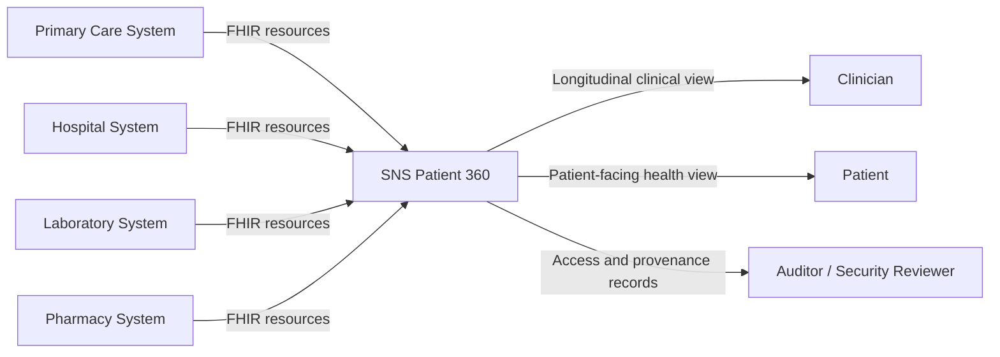
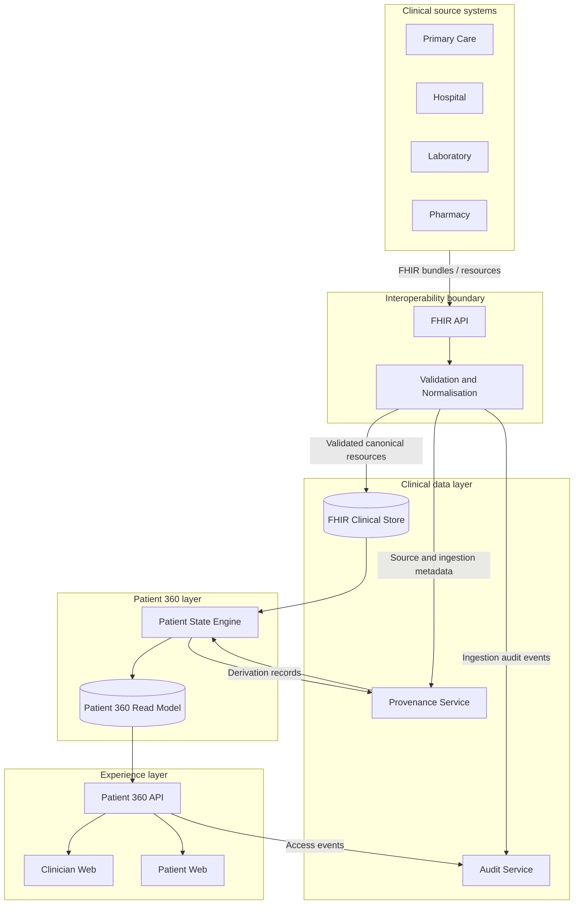
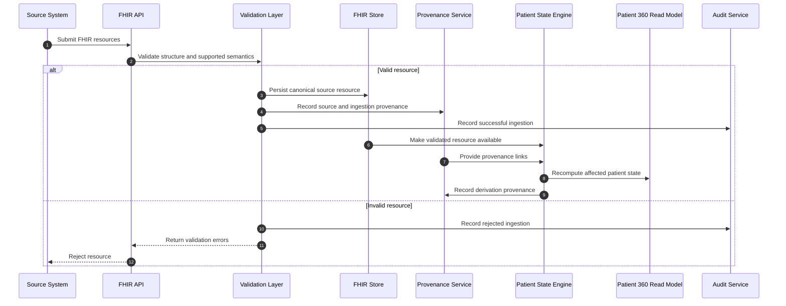
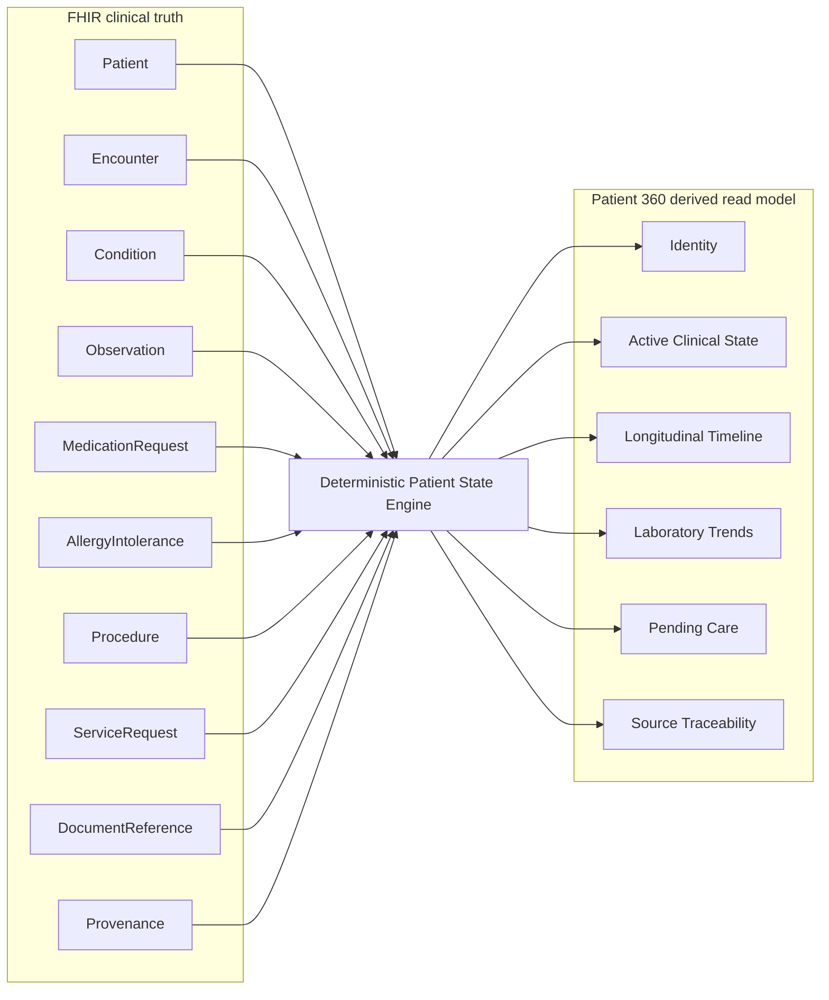
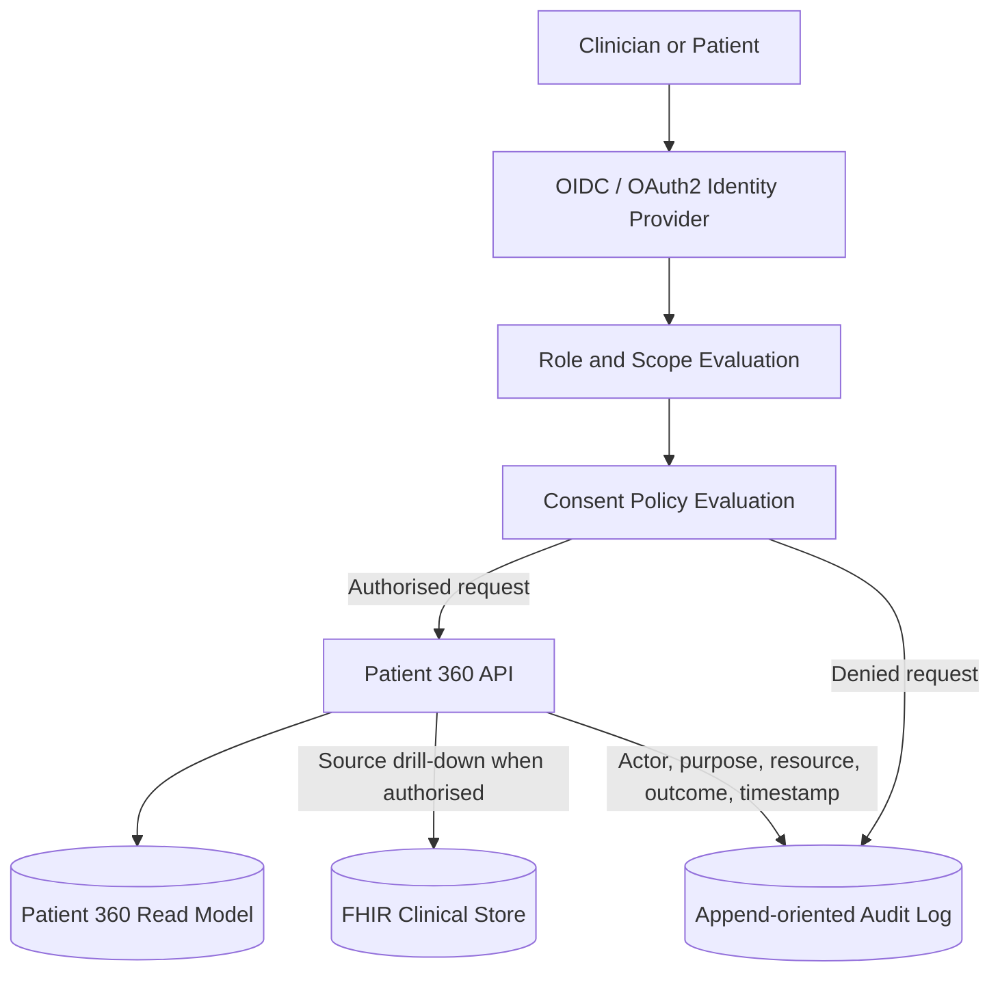
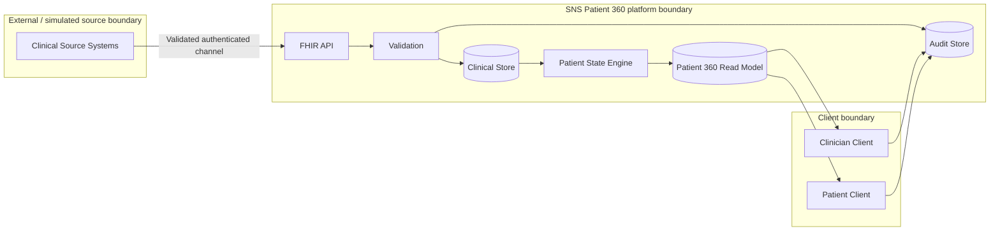

# System architecture

## Purpose

SNS Patient 360 reconstructs a unified longitudinal patient view from fragmented clinical source systems while preserving the clinical meaning, provenance, consent context and auditability of the source records.

The platform does not replace source clinical systems. HL7 FHIR is the interoperability boundary, while Patient 360 is a derived read model optimised for clinician and patient-facing queries.

All architecture diagrams in this repository are expressed as Mermaid inside versioned Markdown documents.

## Architectural principles

1. **FHIR remains the source and interchange truth.** Patient 360 does not redefine the semantics of source clinical resources.
2. **Derived state is traceable.** Every derived Patient 360 item must link to the FHIR resources that support it.
3. **Conflicts are preserved.** Conflicting or superseded clinical facts must not be silently overwritten.
4. **Clinical state is temporal.** Current state and historical facts are distinct concepts.
5. **Access is auditable.** Reads and transformations of clinical information must be attributable.
6. **Synthetic data only.** The reference implementation must not contain real patient data.
7. **AI is not part of the clinical truth layer.** Diagnosis and autonomous treatment recommendations are out of scope.

## System context

## Logical architecture

## Ingestion and derivation sequence

## Patient 360 derivation boundary

## Authentication, authorisation, consent and audit

## Trust boundaries

## Architecture-to-requirements relationship

The architecture is governed by the requirements in [`requirements.md`](requirements.md). Functional requirements define observable platform behaviour. Non-functional requirements define the quality, safety, interoperability and operational constraints under which that behaviour must be delivered.

Implementation PRs should reference the requirement IDs they satisfy and add verification at the appropriate level: unit, contract, integration, security or performance testing.
