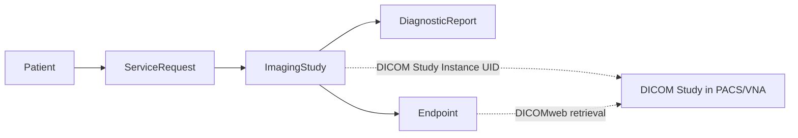
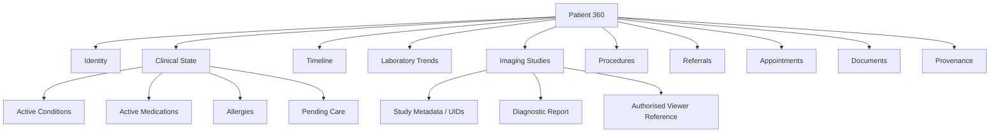
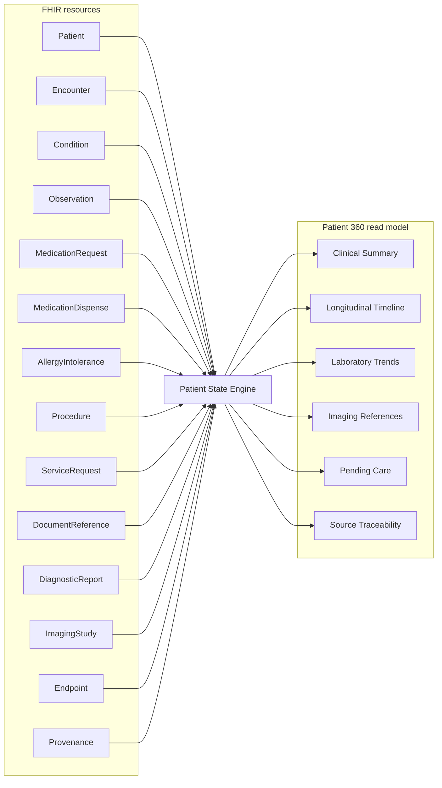

# Initial HL7 FHIR scope

FHIR is the clinical interoperability contract. The Patient 360 application model is a separate read model derived from validated FHIR resources. Diagnostic imaging pixel data remains in the DICOM imaging plane; FHIR stores the clinical relationship, study metadata, report and authorised retrieval references.

## Initial resources

| Resource | Purpose in Patient 360 |
| --- | --- |
| `Patient` | Patient identity and demographics |
| `Practitioner` | Clinical professional identity |
| `Organization` | Source and care-provider organisation |
| `Encounter` | Consultations, admissions and emergency episodes |
| `Condition` | Diagnoses and active clinical problems |
| `Observation` | Laboratory values, vital signs and measured clinical facts |
| `DiagnosticReport` | Laboratory, radiology and diagnostic interpretations |
| `ImagingStudy` | Clinical representation of a DICOM imaging study and study/series metadata |
| `Endpoint` | Authorised service endpoint used by resources such as `ImagingStudy` |
| `MedicationRequest` | Prescribed medication |
| `MedicationDispense` | Dispensing events from pharmacy systems |
| `AllergyIntolerance` | Allergies and intolerances |
| `Immunization` | Vaccination history |
| `Procedure` | Clinical and surgical procedures |
| `CarePlan` | Planned longitudinal care |
| `Appointment` | Scheduled care interactions |
| `ServiceRequest` | Referrals, tests and requested services |
| `DocumentReference` | Clinical documents and reports |
| `Consent` | Patient consent and sharing-policy representation |
| `Provenance` | Origin and transformation traceability |
| `AuditEvent` | Access and security audit events |

## Contract principles

1. Source payloads are validated before they enter the longitudinal clinical store.
2. Source-specific extensions must not silently alter standard FHIR semantics.
3. Derived Patient 360 fields must retain links to their originating resources.
4. Conflicting source records are preserved and surfaced rather than silently overwritten.
5. Clinical state is time-dependent; the system must distinguish current state from historical facts.
6. Terminology bindings and Portuguese implementation profiles will be introduced explicitly rather than guessed.
7. Resource versions are append-preserved using source, resource type, resource id and version id as the source-version identity.
8. `ImagingStudy` and `DiagnosticReport` describe diagnostic imaging clinically; DICOM objects and pixels are not embedded in MongoDB/FHIR documents.
9. DICOM Study Instance UID, Series Instance UID and SOP Instance UID values must be preserved where represented.
10. Image retrieval must go through an authorised DICOM/DICOMweb endpoint rather than direct object-storage access.

## Imaging relationship

`ImagingStudy` is the longitudinal clinical reference to the study. `DiagnosticReport` contains the interpretation. The PACS/VNA remains authoritative for the DICOM hierarchy and image payload.

## Patient 360 read model

## FHIR-to-Patient-360 mapping boundary

The read model is designed for user-facing queries. It is not a replacement for the underlying FHIR resources or DICOM/PACS imaging system.
