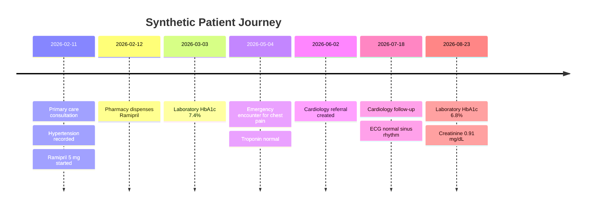
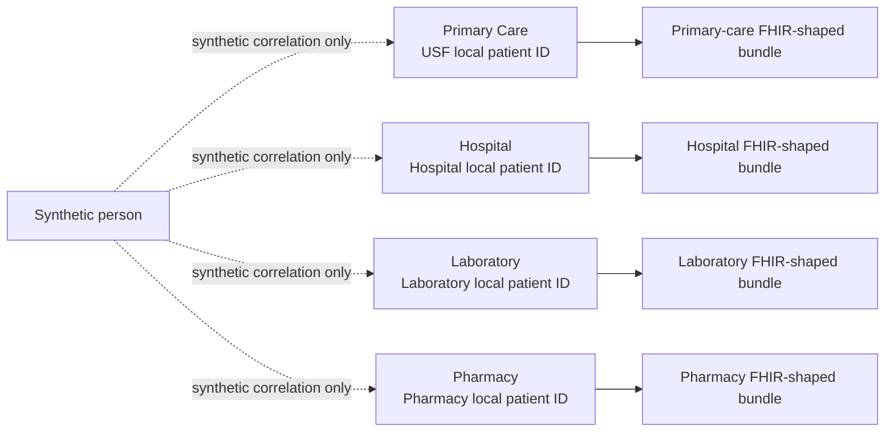

# Synthetic clinical ecosystem

## Purpose

The synthetic ecosystem implements `FR-060`, `FR-061`, `FR-062`, `NFR-070` and `NFR-071` without relying on real healthcare systems or patient data.

The current milestone provides one deterministic synthetic patient journey spanning four independently generated clinical source systems:

- primary care;
- hospital;
- laboratory;
- pharmacy.

Each source owns a different local patient identifier. The sources are correlated only through clearly synthetic master identifiers used by this reference implementation.

## Canonical synthetic journey



## Source independence



The source bundles are exported independently. Patient 360 assembly is deliberately not performed in this milestone; it belongs to the ingestion and identity-resolution milestones.

## Reproducibility

The default journey uses seed `360`. For a fixed seed, all patient identifiers, source records and timestamps are deterministic.

Generate source bundles with:

```bash
sns360-synthetic --seed 360 --output-dir synthetic/generated
```

The command writes:

```text
synthetic/generated/
  primary-care.json
  hospital.json
  laboratory.json
  pharmacy.json
```

Generated files are intended as disposable build artefacts. The source generator and its tests are the canonical definition of the synthetic journey.

## Safety boundary

All identifiers are synthetic and explicitly labelled as such. The generator does not query external healthcare services, and the default CI suite requires no external clinical dependency.
